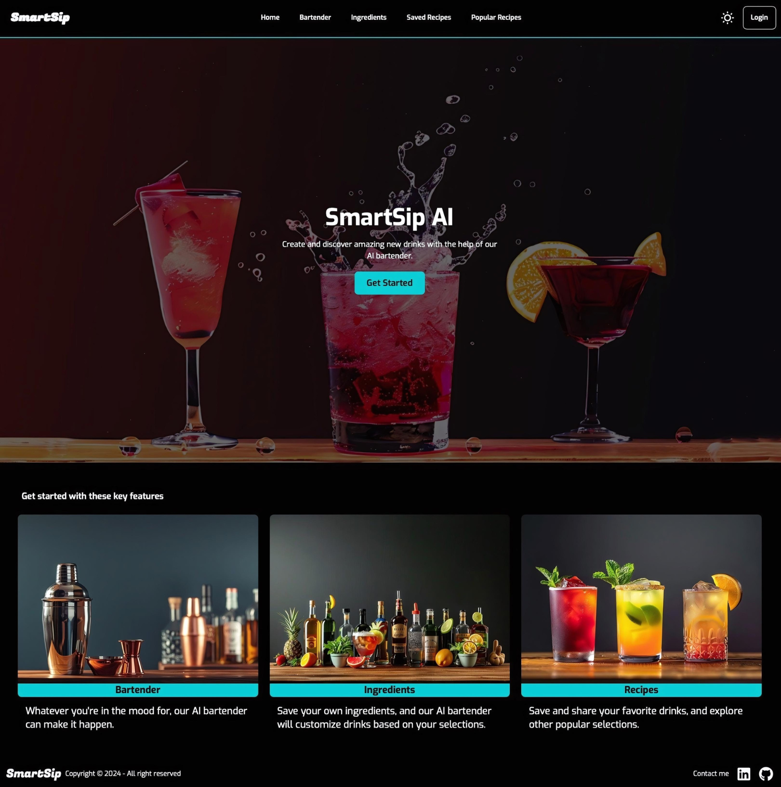
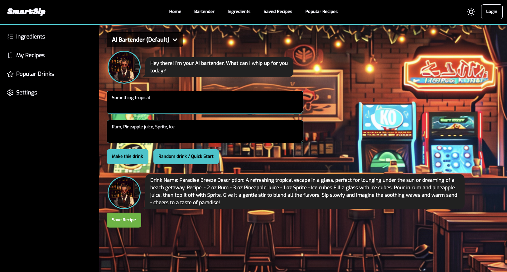
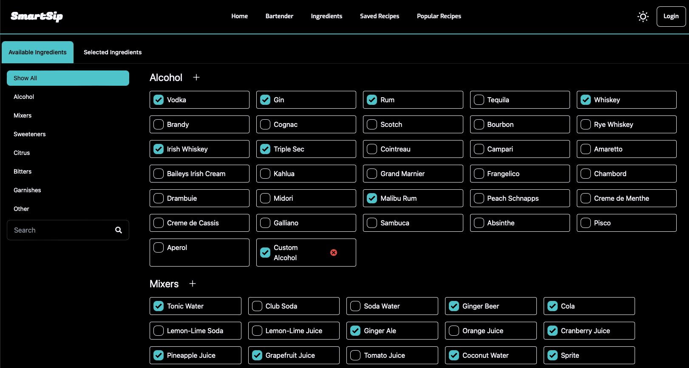
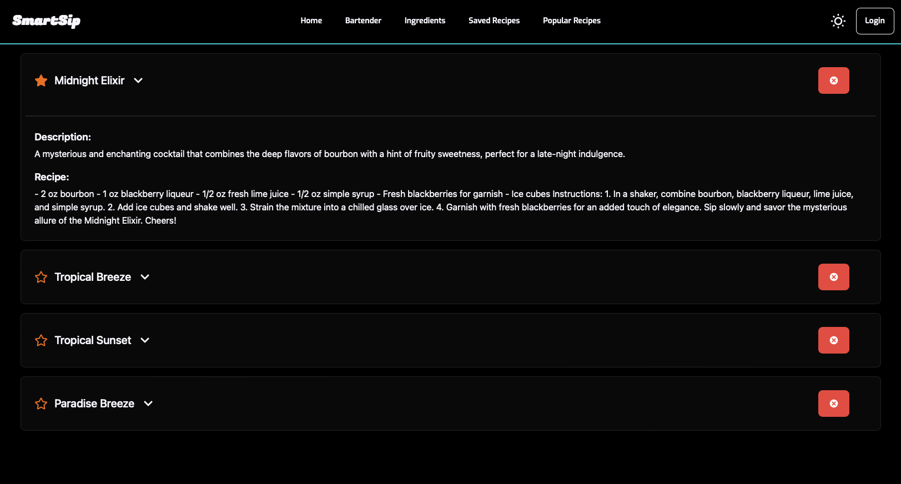

# SmartSip AI 🍹 🧠

## Live Demo: [SmartSip](https://awhalen1999.github.io/smart-sip/)

I created this project for people who **LOVE** discovering new drinks but **HATE** the guesswork and trial-and-error process. This web app uses AI to help you find and create amazing beverages based on your preferences. You can save your favorite recipes and keep track of your ingredients, using them in new recipes. With 10 different bartender personas to choose from, you can enjoy a customized experience each time. Whether you're after something classic or adventurous, SmartSip AI makes exploring new drinks fun and easy.

  

## :computer: Technologies Used

- React
- JavaScript
- Tailwind CSS
- Node

## :heavy_plus_sign: API

- OpenAI API

## :star2: Features

### 🍹 Bartender Page

Discover new drinks with our AI bartender. Choose from 10 different bartender personas for a unique experience each time.

  

### 🛒 Ingredients Page

Keep track of the ingredients you have and use them in your personalized recipes.

  

### 📖 Recipes Page

Save your favorite recipes and easily access them anytime.

  
